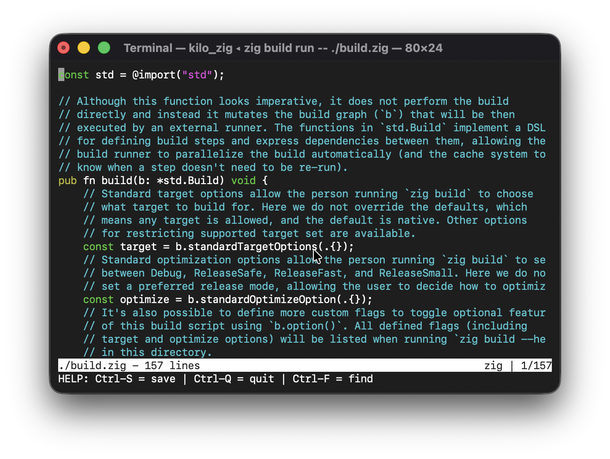

# kilo-zig

A Zig port of the Kilo text editor tutorial.



## Run

```sh
zig build run -- ./build.zig
```

## Credits

- [antirez](https://github.com/antirez), the original author of Kilo
- [viewsourcecode.org Kilo tutorial](https://viewsourcecode.org/snaptoken/kilo/index.html)
